<style>
  :root {
    --color-background: #fff;
    --color-foreground: #333;
    --color-highlight: #f96;
    --color-dimmed: #888;
    font-family: 'Century Gothic';
    color: #3466C2
  }
  {
    font-size: 29px
  }
  code {
    white-space : pre-wrap !important;
    word-break: break-word;
  }
  .columns {
    display: grid;
  }
  h1 {
    justify-content: center;
  }
  section {
    justify-content: start;
  }
  img[alt~="bottom-right"] {
    position: absolute;
    top: 90%;
    right: 1%;
  }
</style>


# Fusion Neutronics Workshop
## Half Day Conference Course

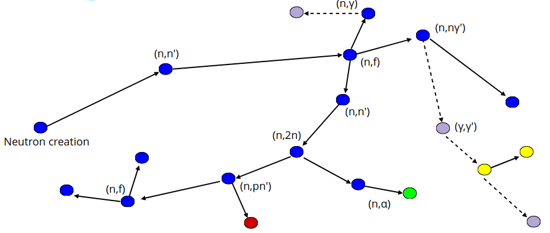
<!--  -->

---

# Agenda

<div class="columns" style="font-size: 26px;">
<div>

- ⚛️ Why OpenMC
- ⚙️ Installation options
- 🧱 Making materials
- 📈 Plotting cross sections
- 🧩 Constructive Solid Geometry (CSG)
- ☢️ Neutron source terms
- ⚛️ Tritium Breeding Ratio simulation
- 📊 Neutron spectra simulation

</div>
<div>

- 🩻 Dose simulations
- 🎯 Variance reduction
- 🏗️ Converting CAD to DAGMC models
- 🕸️ Unstructured mesh tally
- 🔥 Depletion / activation / transmutation
- ⏱️ Shutdown dose rate simulation
- 🧑‍💻 How to get support

</div>
</div>

---

# Simulation needed

Simulations are necessary when wanting to predict the nuclear response.

<div class="columns" style="font-size: 28px;">
<div>

- TBR
- DPA
- Gas production
- Heating (prompt and decay)
- Dose (prompt and decay)

</div>
<div>

- Transmutation
- Neutron / Photon flux spectra
- Diagnostic responses
- Magnet + insulator lifetimes


</div>
</div>

---

# Why OpenMC

<div style="font-size: 20px;">

| Code | Python interface | High performance / scalable | Physics | Permissive license | CAD support | Validated |
| --- | :-: | :-: | :-: | :-: | :-: | :-: |
| MCNP | ❓ | ❌ | ✅ | ❌ | ✅ | ✅ |
| Serpent | ✅ | ✅ | ✅ | ❌ | ✅ | ✅ |
| FLUKA | ❌ | ❓ | ✅ | ❌ | ❓ | ❓ |
| Geant4 | ❓ | ❓ | ✅ | ✅ | ✅ | ❓ |
| PHITS | ❓ | ❓ | ❌ | ❓ | ❓ | ❓ |
| OpenMC | ✅ | ✅ | ✅ | ✅ | ✅ | ✅ |

</div>

---

# OpenMC community

*The best way to predict the future is to create it*

- 179 contributors from across the globe have contributed to the source code.
- Many others performing V&V, raising issues and providing feedback.

---

# Why OpenMC

<div style="font-size: 18px;">

| Code | Python interface | High performance / scalable | Physics | Permissive license | CAD support | Validated | Ability to contribute |
| --- | :-: | :-: | :-: | :-: | :-: | :-: | :-: |
| MCNP | ❓ | ❌ | ✅ | ❌ | ✅ | ✅ | ❌ |
| Serpent | ✅ | ✅ | ✅ | ❌ | ✅ | ✅ | ❌ |
| FLUKA | ❌ | ❓ | ✅ | ❌ | ❓ | ❓ | ❌ |
| Geant4 | ❓ | ❓ | ✅ | ✅ | ✅ | ❓ | ❌ |
| PHITS | ❓ | ❓ | ❌ | ❓ | ❓ | ❓ | ❌ |
| OpenMC | ✅ | ✅ | ✅ | ✅ | ✅ | ✅ | ✅ |

</div>

---

# Growing adoption

The relative ease of install, permissive MIT licensing and Python API have contributed to the rising popularity of OpenMC.

<div class="columns">
<div>

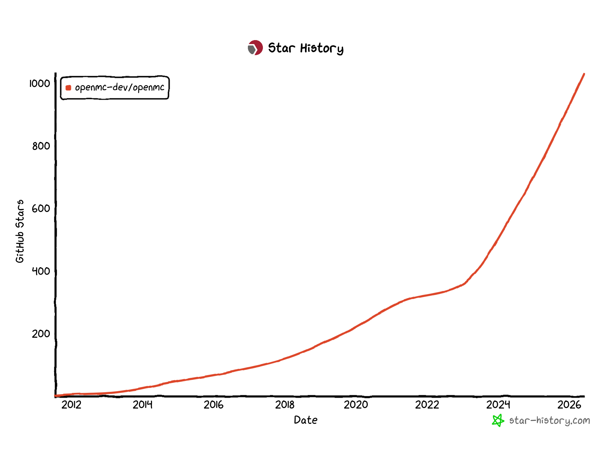
[Conda downloads](https://anaconda.org/channels/conda-forge/packages/openmc/overview)

</div>
<div>

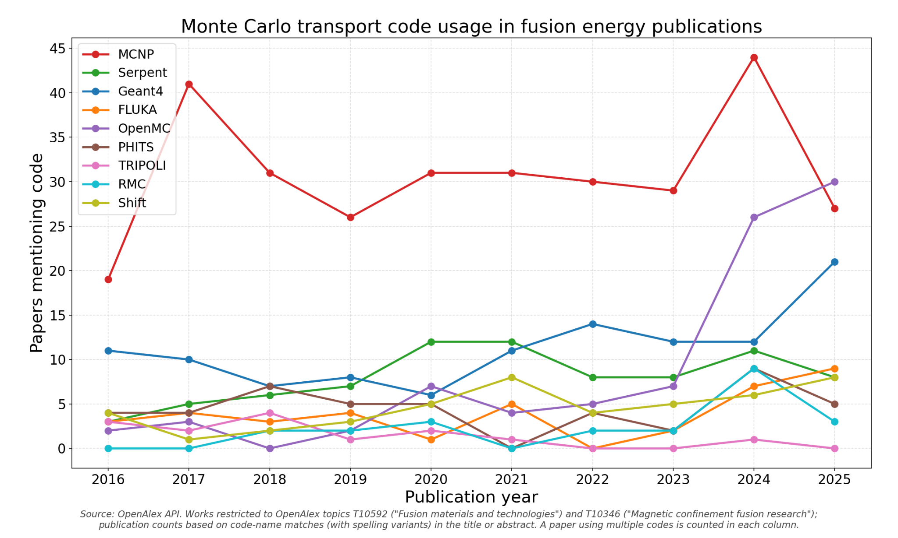
[Paper citations](https://scholar.google.com/scholar?cites=10241703693179510971&as_sdt=2005&sciodt=0,5&hl=en)

</div>
</div>

---

# Installation options

<div class="columns3" style="font-size: 22px;">
<div>

### Conda
- Stable releases only
- Older version
- No Embree acceleration
- Relatively easy
- Contains MPI

</div>
<div>

### Clone, compile, pip
- Most complex, needs many commands
- Install takes longer
- Latest version (develop)
- Optimised for local hardware
- Highly customisable

</div>
<div>

### Pip pre-built wheel
- Does not contain MPI
- Relatively easy
- Up to date version

</div>
</div>

---

# Install OpenMC and workshop deps

<div class="columns">
<div>

The workshop documentation is the best source of installation instructions.

<a href="https://fusion-energy.github.io/neutronics-workshop/docs/install_pip.html" style="text-decoration: underline;">https://fusion-energy.github.io/neutronics-workshop/docs/install_pip.html</a>

</div>
<div>

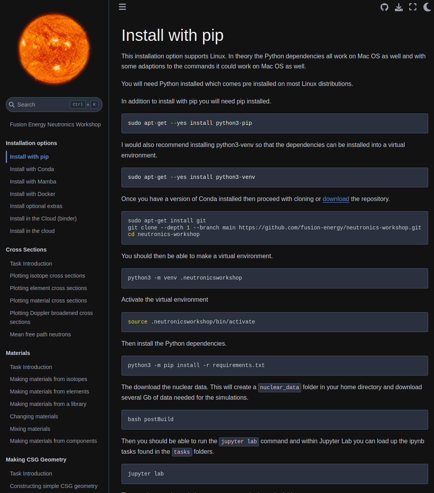

</div>
</div>

---

# Using Git

Download the workshop.

```bash
git clone https://github.com/fusion-energy/neutronics-workshop.git
cd neutronics-workshop
```

---

# Download nuclear data

- Download and process the nuclear data package
  - [openmc_data](https://github.com/openmc-data-storage/openmc_data)
- Scripts used to make data for [openmc.org](http://openmc.org)
  - [openmc-dev/data](https://github.com/openmc-dev/data)
- Manage nuclear data, including Sandy
  - [ndmanager](https://github.com/nplinden/ndmanager)

```bash
bash postBuild
```

Downloads the nuclear data cross sections and the decay data chain file to ```~/nuclear_data```.

---

# Jupyter Lab / Notebook usage

<div class="columns">
<div>

- Run a cell with shift and enter
- Run all cells, or run in order
- Add code cells and text cells
- Shift and tab to get docstrings
- Buttons for reset

</div>
<div>


</div>
</div>

---

# Making materials

<div class="columns">
<div>

Materials can be made from:

- **Nuclides**
- Elements
- Chemical formulas
- Components

</div>
<div>


</div>
</div>

---

# Making materials

<div class="columns">
<div>

Materials can be made from:

- Nuclides
- **Elements**
- Chemical formulas
- Components

</div>
<div>


</div>
</div>

---

# Making materials

<div class="columns">
<div>

Materials can be made from:

- Nuclides
- Elements
- **Chemical formulas**
- Components

</div>
<div>


</div>
</div>

---

# Making materials

<div class="columns">
<div>

Materials can be made from:

- Nuclides
- Elements
- Chemical formulas
- **Components**

</div>
<div>


</div>
</div>

---

# Task 1 - Making materials


In Jupyter Lab / Notebook try

---

# Plotting cross sections

<div class="columns">
<div>

- nuclide → microscopic cross section
- element → microscopic cross section
- material → macroscopic cross section

Scores such as heating, heating-local (eV-barn) and damage-energy (eV-barn) are also available.

</div>
<div>

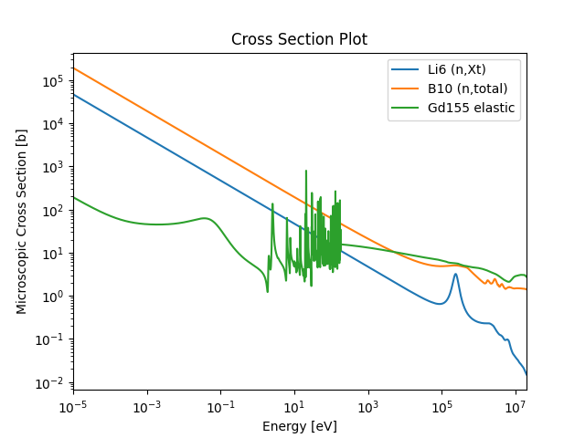

</div>
</div>

---

# Task 2 - Plotting cross sections


In Jupyter Lab / Notebook try

---

# Bonus task - nuclear data

Try plotting the neutron energy distribution of an (n,2n) reaction.

[github.com/fusion-energy/neutronics-workshop/issues/228](https://github.com/fusion-energy/neutronics-workshop/issues/228)

---

# Making CSG geometry

<div class="columns">
<div style="width: 150%;">

The simplest region is a single surface and a cell defined as below (-) that surface.

```python
import openmc

surface_sphere = openmc.Sphere(r=10.0)
inside_sphere = -surface_sphere
cell_sphere = openmc.Cell(region=inside_sphere)
cell_sphere.fill = steel
```

</div>
<div style="display: flex; justify-content: flex-end">

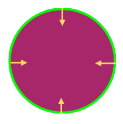

</div>
</div>

---

# Making CSG geometry

<div class="columns">
<div style="width: 150%;">

Cells can also be constrained by multiple surfaces. This example is above (+) one surface and (&) below (-) another.

```python
import openmc

surf_sphere1 = openmc.Sphere(r=10.0)
surf_sphere2 = openmc.Sphere(r=20.0)
between_spheres = +surf_sphere1 & -surf_sphere2
cell_sphere = openmc.Cell(region=between_spheres)
cell_sphere.fill = steel
```

</div>
<div style="display: flex; justify-content: flex-end">

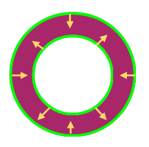

</div>
</div>

---

# Making CSG geometry

<div class="columns">
<div style="width: 150%;">

The outermost surface of the model should have a ```boundary_type``` set to ```"vacuum"``` to indicate that neutrons should not be tracked beyond this surface.

```python
import openmc

surf_sphere = openmc.Sphere(r=10.0, boundary_type="vacuum")
region_inside_sphere = -surf_sphere
cell_inside_sphere = openmc.Cell(region=region_inside_sphere)
cell_inside_sphere.fill = steel
```

</div>
<div style="display: flex; justify-content: flex-end">


</div>
</div>

---

# Visualizing CSG geometry

[OpenMC supports classic CSG surface families](https://docs.openmc.org/en/stable/usersguide/geometry.html), and there are many built in ways to view the geometry.

- Slice plots: ```model.plot()```, ```geometry.plot()```, ```cell.plot()```, ```region.plot()```
- [Voxel plots](https://fusion-energy.github.io/neutronics-workshop/tasks/task_03_making_CSG_geometry/3_viewing_the_geometry_as_vtk.html): solid and ray traced (```RayTracePlot```)

There are also extra packages for viewing geometry:

- [OpenMC plotter](https://github.com/openmc-dev/plotter)
- [OpenMC geometry plot](https://github.com/fusion-energy/openmc_geometry_plot/)
- [Stellarvista](https://github.com/Thea-Energy/stellarvista)

---

# Task 3 - making and visualizing CSG


In Jupyter Lab / Notebook try

---

# Neutron birth energy

<div class="columns">
<div>

- Deuterium (D) and Tritium (T) nuclides fuse, emitting an alpha particle and a neutron.
- The neutron energy is dominated by the binding-energy release, with the spread due to the kinetic energy of the incident D and T nuclei.
- Our neutron travels away from the fusion event with 14.1 MeV of energy (ignoring the magnetic field).

</div>
<div>

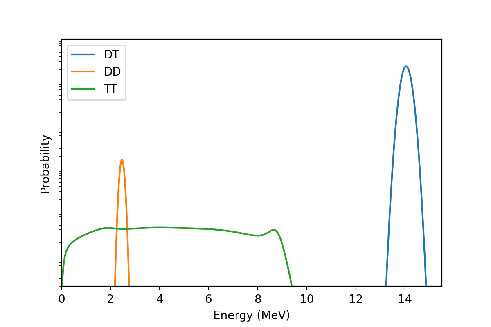

Plot created with [fusion-neutron-utils](https://github.com/fusion-energy/fusion_neutron_utils)

</div>
</div>

---

# Particle source

<div class="columns">
<div>

- Make a simple point neutron source
- Make a ring neutron source
- Visualize the source
- [Visualize particle tracks](https://fusion-energy.github.io/neutronics-workshop/tasks/task_04_make_sources/4_neutron_tracks.html)
- Make a gamma source

</div>
<div>

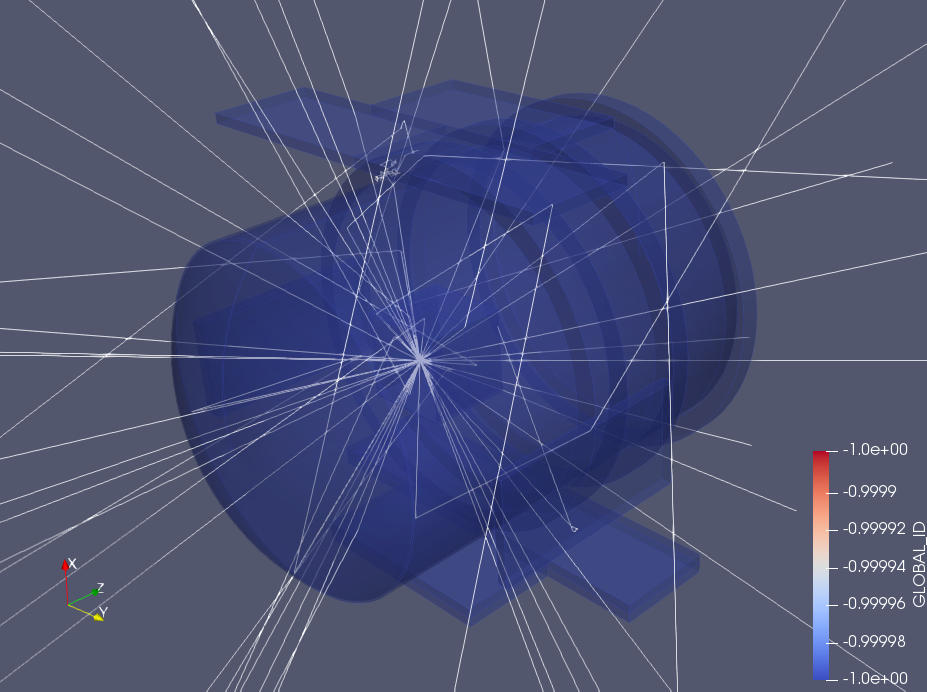

</div>
</div>

---

# Tasks 4 and 5 - Define a neutron source


In Jupyter Lab / Notebook try

---

# Simulation settings

<div class="columns">
<div>

A minimal settings object for fusion simulations.

Settings objects also accept variance reduction configurations, weight windows and volume calculation settings.

[Link to OpenMC docs](https://docs.openmc.org/en/stable/pythonapi/generated/openmc.Settings.html)

</div>
<div>

```python
settings = openmc.Settings(
    batches=10,
    particles=10000,
    photon_transport=True,
    run_mode='fixed source',
    source=my_source,
)
```

</div>
</div>

---

# Tally scores

<div class="columns">
<div>

A tally can record different scores. Many scores are available:

- H3-production
- MT 16 (n,2n)
- (n,total)
- heating / heating-local
- damage-energy
- flux

See the [documentation](https://docs.openmc.org/en/stable/usersguide/tallies.html#id2) for more information.

</div>
<div>

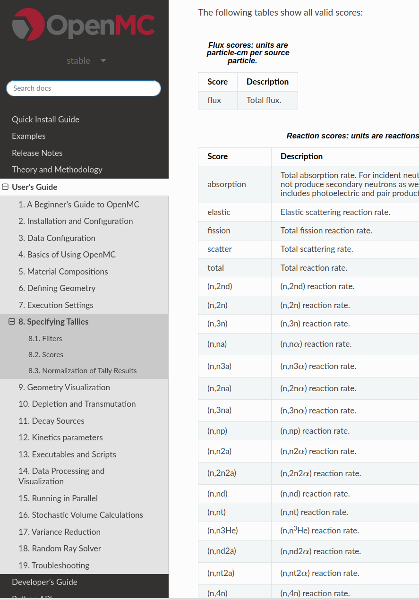

</div>
</div>

---

# Cell filters

Tally filters are used to refine how and what a tally records.

The ```CellFilter``` tells the tally to record on a specific cell.

```python
openmc.CellFilter([cell_1])
```

---

# Task 6 - TBR tally


In Jupyter Lab / Notebook try

---

# Post processing tricks

Modify task 6 so that you can access the ```tally.mean``` using ```apply_tally_results```.

```python
model.run(apply_tally_results=True)
```

[openmc.model.Model documentation](https://docs.openmc.org/en/stable/pythonapi/generated/openmc.model.Model.html)

---

# Energy and particle filters

Tally filters refine how and what a tally records.

- The ```EnergyFilter``` tells the tally to record the score on provided energy bins.
- The ```ParticleFilter``` can be used to record photons or neutrons.

```python
openmc.EnergyFilter(np.linspace(0, 15e6, 719))
openmc.ParticleFilter(['neutron'])
```

---

# Task 7 - neutron spectra tally


In Jupyter Lab / Notebook try

---

# Energy function filters

The ```EnergyFunctionFilter``` tells the tally to multiply by a factor when scoring the particle, for example to convert flux to dose.

```python
energy_function_filter = openmc.EnergyFunctionFilter(
    energy=energy_bins,
    y=dose_coeffs,
    interpolation="cubic",
)
```

---

# Task 8 - cell dose tally


In Jupyter Lab / Notebook try

---

# Meshes and mesh filters

<div class="columns">
<div>

Two options for making the mesh, then use it in the tally as another filter type.

```python
mesh = openmc.RegularMesh().from_domain(
    domain=geometry,
    dimension=[100, 100, 100],
)
mesh_filter = openmc.MeshFilter(mesh)
flux_tally.filters = [mesh_filter]
```

</div>
<div>

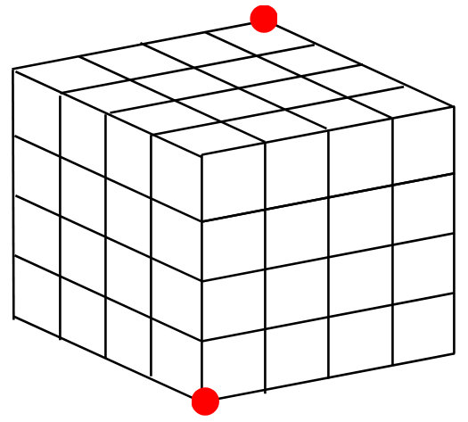

</div>
</div>

---

# Task 9 - mesh dose tally


In Jupyter Lab / Notebook try

---

# Variance reduction

OpenMC supports:

- Implicit capture
- Weight windows
- ~~Importance values~~

OpenMC can generate weight windows using:

- the MAGIC method
- Random Ray + FW-CADIS

---

# Task 10 - weight windows


In Jupyter Lab / Notebook try

---

# DAGMC

<div class="columns">
<div>

DAGMC lets OpenMC transport particles through CAD geometry converted to a surface mesh.

</div>
<div>

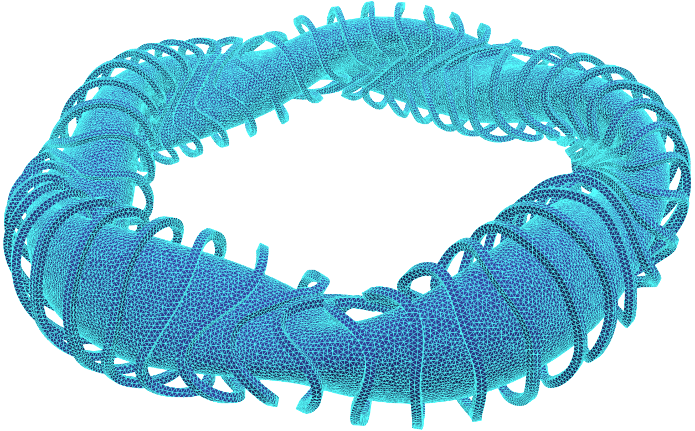
[open_stellarator_models](https://github.com/proximafusion/open_stellarator_models)

</div>
</div>

---

# CAD overview

Today simulation on CAD in OpenMC uses:

- [DAGMC](https://svalinn.github.io/DAGMC/) for surface mesh geometry
- DAGMC for volume mesh (unstructured mesh)
- [LibMesh](https://libmesh.github.io/) for surface mesh
- LibMesh for volume mesh (unstructured mesh)

In the future, [XDG](https://github.com/pshriwise/xdg) will offer another option.

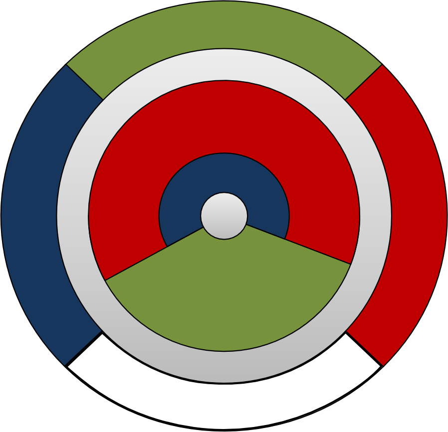  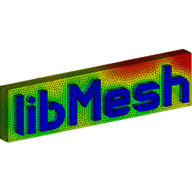 

---

# Task 11 - convert CAD to DAGMC


In Jupyter Lab / Notebook try

---

# Visualizing CAD to DAGMC

<div class="columns">
<div>

In addition to slice plots, the OpenMC plotter and the OpenMC geometry plot, there are two options specifically for DAGMC geometry viewing:

- [dagmc_h5m_file_inspector](https://github.com/fusion-energy/dagmc_h5m_file_inspector)
- [stellarvista](https://github.com/Thea-Energy/stellarvista)

</div>
<div>

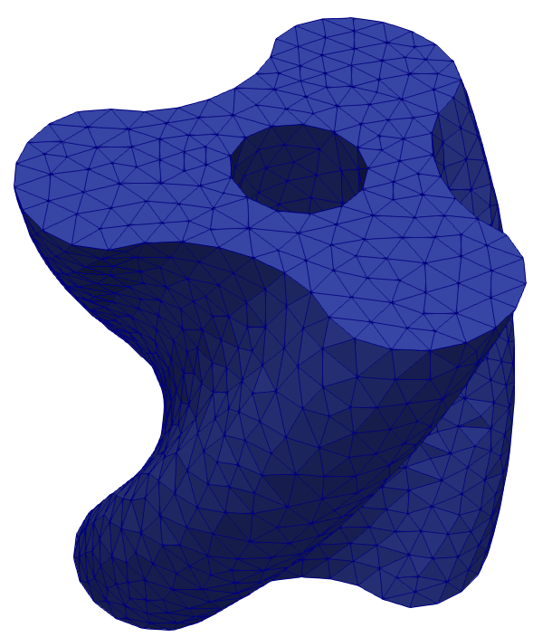

</div>
</div>

---

# Task 12 - Simulating with DAGMC


In Jupyter Lab / Notebook try

---

# Unstructured meshes

Unstructured meshes are currently available via two libraries.

- **MOAB**: tet mesh only, file is h5 or vtk format
- **LibMesh**: tet, hex and mixed meshes, file is exodus format

In the future XDG will offer another option.

---

# Task 13 - Simulating with unstructured mesh


In Jupyter Lab / Notebook try

---

# Activation pathways

<div class="columns">
<div>

- Activation reactions can result in stable and unstable isotopes.
- Neutron induced reactions tend to not increase the proton number.
- Irradiation of 5 stable Zr isotopes produces 20 unstable isotopes via direct reactions.

</div>
<div>

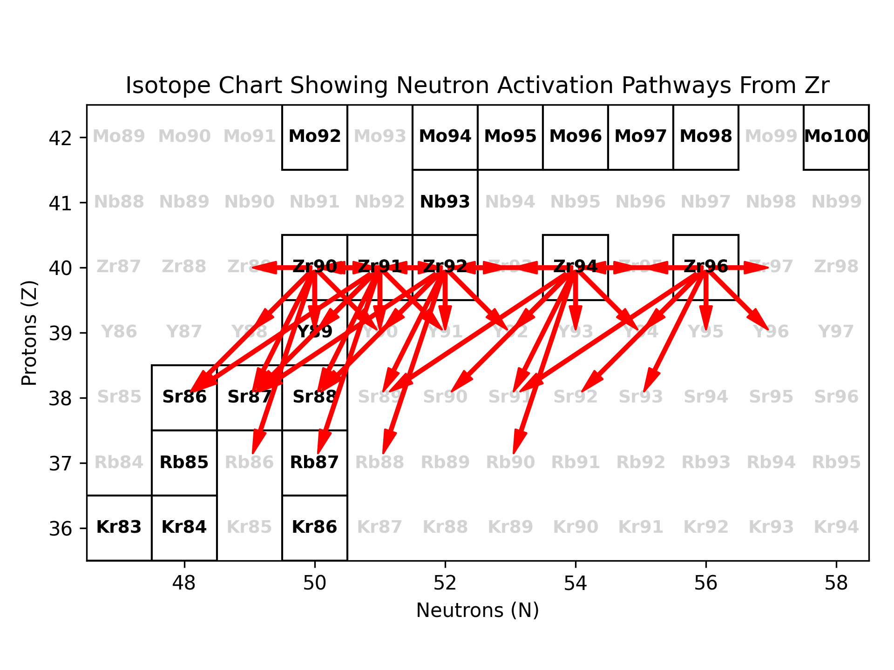

</div>
</div>

---

# Decay pathways

<div class="columns">
<div>

- Unstable isotopes decay.
- Beta- decay transmutates the nuclide +1 proton, -1 neutron, and gammas are also emitted.
- Unstable isotopes can have multiple decay routes, each with a different probability (branching ratio).
- Each has a characteristic half life.
- Stable and natural abundances are not the same thing.

</div>
<div>

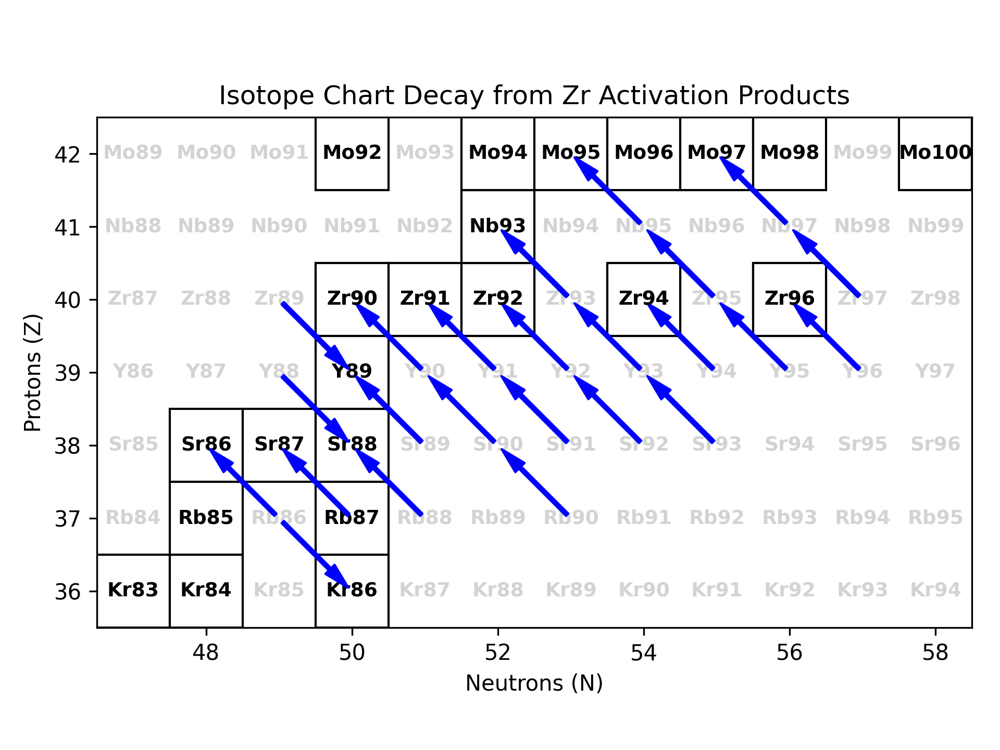

</div>
</div>

---

# Task 14 - transport free transmutation


In Jupyter Lab / Notebook try

---

# Task 15 - transmutation with transport


In Jupyter Lab / Notebook try

---

# Radioactive decay

<div class="columns">
<div>

- Decay can produce different particles: Beta+, Beta-, alpha, neutron, gamma.
- We are unlikely to see neutron decay products in fusion (with the exception of Be).
- The range of alpha and beta is typically short and often blocked within the material itself.
- The primary interest is the gamma.

</div>
<div>

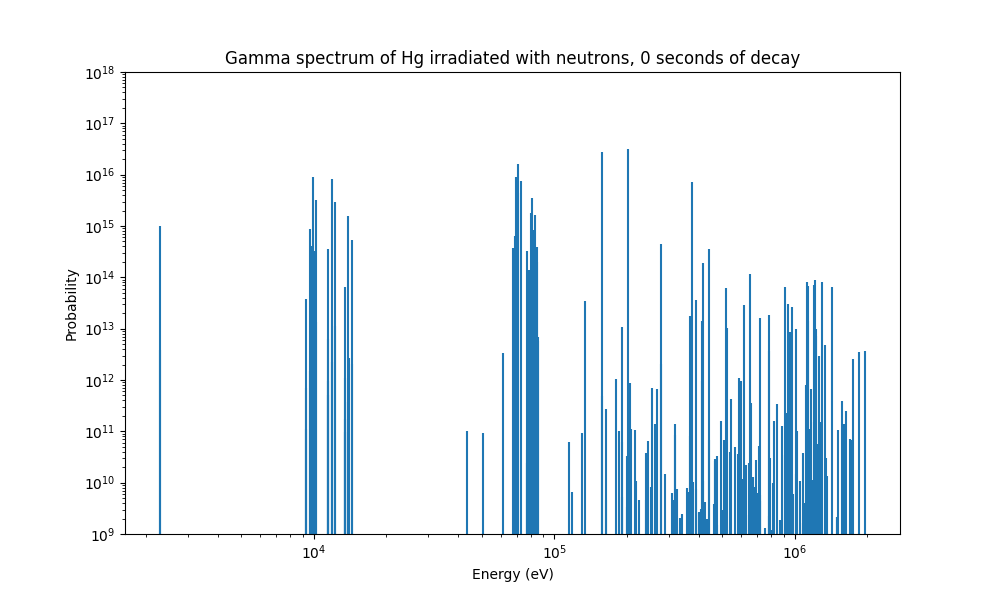

</div>
</div>

---

# Task 16 - transport with decay gammas


In Jupyter Lab / Notebook try

---

# Getting support with OpenMC

Perhaps the best part of OpenMC is the community.

- [Monthly meetup](https://openmc.discourse.group/t/openmc-monthy-meeting-dates-2026/6025)
- [Discourse](https://openmc.discourse.group/)
- [Github issues](https://github.com/openmc-dev/openmc/)
- LLM
- [Neutronics-workshop discussions](https://github.com/fusion-energy/neutronics-workshop/discussions)

---

# Other features we have not covered

<div class="columns">
<div>

- R2S shutdown / residual dose simulations
- Tally triggers
- OpenMC lib C++ interface

</div>
<div>

- Volume calculations
- Track simulations
- Coupled depletion

</div>
</div>

Many more topics are covered in the neutronics workshop.

---

# Other OpenMC courses

- NEA databank
- Conferences
- [OSSFE](https://ossfe.org)

We are also considering making a 2 day fusion neutronics analysis workshop depending on demand and availability.

---

# How did we do

<div class="columns" style="font-size: 26px;">
<div>

- ⚛️ Why OpenMC
- ⚙️ Installation options
- 🧱 Making materials
- 📈 Plotting cross sections
- 🧩 Constructive Solid Geometry (CSG)
- ☢️ Neutron source terms
- ⚛️ Tritium Breeding Ratio simulation
- 📊 Neutron spectra simulation

</div>
<div>

- 🩻 Dose simulations
- 🎯 Variance reduction
- 🏗️ Converting CAD to DAGMC models
- 🕸️ Unstructured mesh tally
- 🔥 Depletion / activation / transmutation
- ⏱️ Shutdown dose rate simulation
- 🧑‍💻 How to get support

</div>
</div>
