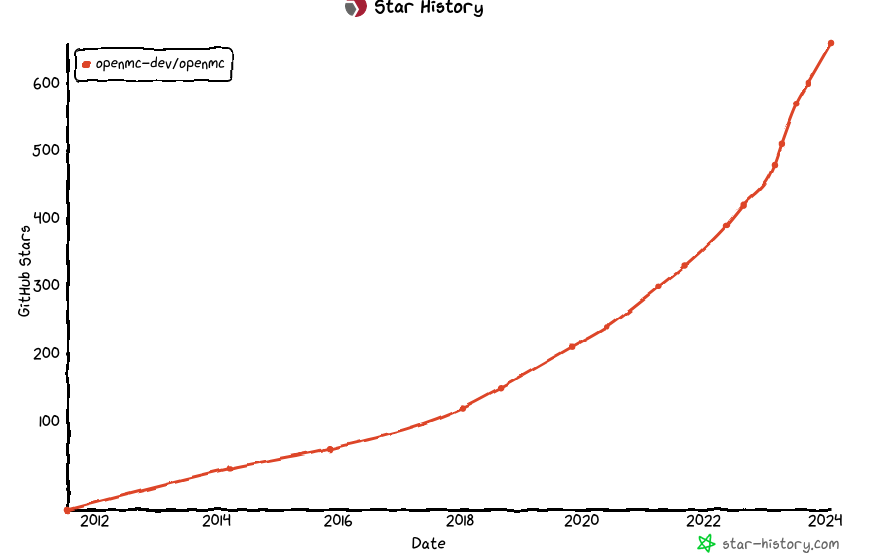

<style>
  :root {
    --color-background: #fff;
    --color-foreground: #333;
    --color-highlight: #f96;
    --color-dimmed: #888;
  }
  {
    font-size: 29px
  }
  code {
    white-space : pre-wrap !important;
    word-break: break-word;
  }
  /* h1 {
    font-family: Courier New;
  } */
</style>


# Fusion Neutronics Workshop


---


# Why is neutronics useful


- **Radioactivity** - Neutrons activate material, making it radioactive leading to handling and waste storage requirements.​
- **Hazardous** - Neutrons are Hazardous to health and shielded will be needed to protect the workforce.​
- ***Produce fuel*** - Neutrons will be needed to convert lithium into tritium to fuel the reactor.​
- ***Electricity*** - 80% of the energy release by each DT reaction is transferred to the neutron.​
- ***Structural integrity*** - Neutrons cause damage to materials such as embrittlement, swelling, change conductivity …​
- ***Diagnose*** - Neutrons are an important method of measuring a variety of plasma parameters (e.g. Q value).​

---

# Topics Covered Half Day Course

- Neutron and Photon interaction cross sections

- Material creation

- Particle sources

- Constructive Solid Geometry (CSG)

- Tallies (heat, tritium breeding ratio, damage, flux)

- Neutron activation

---

# Getting started

- 🐋 Install Docker

- 🔽 Download the docker image

- 🏃Run the docker image

- 🔗 Navigate to the URL in the terminal

- 🖥️ Install Paraview and FreeCAD

Detailed instructions are on [GitHub](https://github.com/fusion-energy/neutronics-workshop/tree/main#local-installation)

---
# Containers


Install single package (Docker) and avoid installing a few hundred packages.
- Portable
- Reproducible
- Security
- Isolation
- Deployable

---

# Task synopsis

- Collection of Jupyter notebooks

- Separate task folder for each topic

- Learning outcomes for each task

- Simulation outputs include:
    - numbers
    - graphs
    - images
    - 3D visualization.

---

# OpenMC

<!-- [](https://star-history.com/#openmc-dev/openmc&Date) -->
[](https://star-history.com/#openmc-dev/openmc&Date)

- Increasing adoption
- Supportive community
- GitHub repository
- Permissive license
- Python API

---
<!-- 
# Neutronics simulation tools - DAGMC

- Need for CAD based models
- Open source method of geometry creation
- Community

--- -->

<!-- # Neutronics simulation tools - Paramak

- Fusion reactor models from parameters
- Compatible with DAGMC and OpenMC based workflow

--- -->


# code slide

Content of slide 3


```ts {monaco}
console.log('HelloWorld')
console.log('HelloWorld')
console.log('HelloWorld')
console.log('HelloWorld')
console.log('HelloWorld')
console.log('HelloWorld')
console.log('HelloWorld')
console.log('HelloWorld')
console.log('HelloWorld')
console.log('HelloWorld')
console.log('HelloWorld')
```
