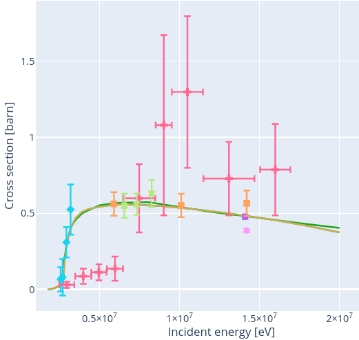
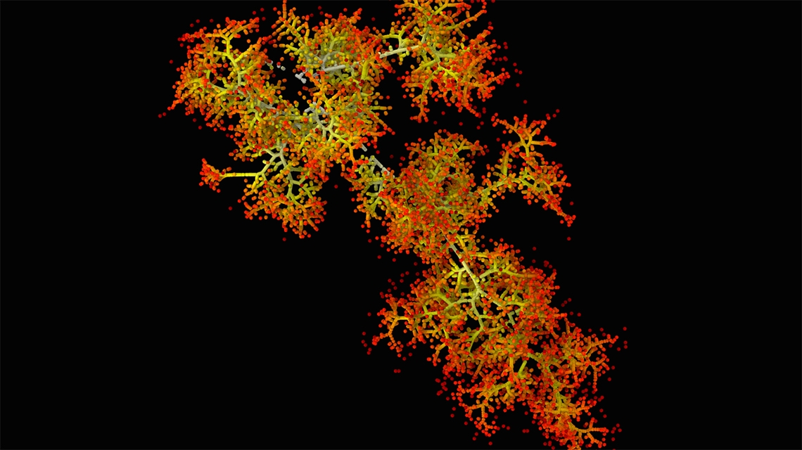
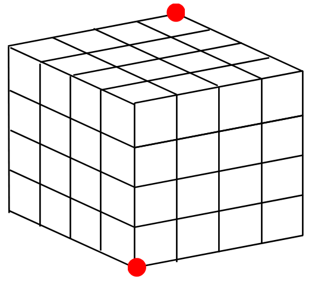

<style>
  :root {
    --color-background: #fff;
    --color-foreground: #333;
    --color-highlight: #f96;
    --color-dimmed: #888;
  }
  {
    font-size: 29px
  }
  code {
    white-space : pre-wrap !important;
    word-break: break-word;
  }
  .columns {
    display: grid;
    /* grid-template-columns: repeat(2, minmax(0, 1fr));
    gap: 1rem; */
  }
  h1 {
    justify-content: center;
  }
  section {
    justify-content: start;
  }
</style>


# Fusion Neutronics Workshop


---


# Why is neutronics useful


- **Radioactivity** - Neutrons activate material, making it radioactive leading to handling and waste storage requirements.​
- **Hazardous** - Neutrons are Hazardous to health and shielded will be needed to protect the workforce.​
- ***Produce fuel*** - Neutrons will be needed to convert lithium into tritium to fuel the reactor.​
- ***Electricity*** - 80% of the energy release by each DT reaction is transferred to the neutron.​
- ***Structural integrity*** - Neutrons cause damage to materials such as embrittlement, swelling, change conductivity …​
- ***Diagnose*** - Neutrons are an important method of measuring a variety of plasma parameters (e.g. Q value).​

---

# Topics Covered Half Day Course

- Neutron and Photon interaction cross sections

- Material creation

- Particle sources

- Constructive Solid Geometry (CSG)

- Tallies (heat, tritium breeding ratio, damage, flux)

- Neutron activation

---

# Getting started

- 🐋 Install Docker

- 🔽 Download the docker image

- 🏃Run the docker image

- 🔗 Navigate to the URL in the terminal

Detailed instructions are on [GitHub](https://github.com/fusion-energy/neutronics-workshop/tree/main#local-installation)


---

# Containers


Install single package (Docker) and avoid installing a few hundred packages.

- Portable
- Reproducible
- Security
- Isolation
- Deployable

---

# Tasks


- Collection of Jupyter notebooks

- Separate task folder for each topic

- Learning outcomes for each task

- Simulation outputs include:
    - numbers
    - graphs
    - images
    - 3D visualization.

---

# OpenMC

<!-- [](https://star-history.com/#openmc-dev/openmc&Date) -->
[](https://star-history.com/#openmc-dev/openmc&Date)

- Increasing adoption
- Supportive community
- GitHub repository
- Permissive license
- Python API

---


# Getting started

1. Run the docker image
    ```docker run -p 8888:8888 ghcr.io/fusion-energy/neutronics-workshop```

2. Double click on the ```half-day-workshop``` folder circled in red.


---


# Timetable

<div class="columns"  style="font-size:      20px;">
<div>

- 9.00 Introduction presentation  10
- 9.10 Plotting cross sections    30
    - task_01_isotope_xs_plot
    - task_02_element_xs_plot
    - task_03_material_xs_plot
- 9.40 Making materials            15
    - task_04_example_materials_from_isotopes
    - task_05_example_materials_from_elements
- 9.55 Geometry                   20
    - task_06_simple_csg_geometry
- 10.15 Break                      15
- 10.30 Plotting particles        35
  - task_07_point_source_plots
  - task_08_ring_source
  - task_09_plasma_source_plots

</div>
<div>

- 11.05 Tritium Breeding Ratio (TBR)    10
  - task_10_example_tritium_production
- 11.15 Damage (DPA)                    15
  - task_11_find_dpa
- 11:30 Break                           15
- 11:45 neutron photon spectra          30
  - task_12_example_neutron_spectra_on_cell  
  - task_13_example_photon_spectra
- 12.15 mesh tallies                    15
  - task_14_example_2d_regular_mesh_tallies
- 12.30 activation                      15
  - task_15_full_pulse_schedule
- 12.45 Putting it all together         15
  - task_16_optimal_design

</div>
</div>

---
# Task 1, 2, 3
# Microscopic Cross Sections

- Probability of interaction is characterised by the microscopic cross-section (σ). It is the effective size of the nucleus.

- Cross section data is key to the neutronics workflow and provide us with the likelihood of a particular interaction.

- Cross sections can be measured experimentally with monoenergetic neutrons.

---

# Experimental data

<div class="columns"  style="font-size: 30px;">
<div>

Availability of experimental data varies for different reactions and different isotopes.

Typically the experimental data is then interpreted to create evaluation libraries, such as ENDF, JEFF, JENDL, CENDL.

</div>
<div>

[](https://nds.iaea.org/dataexplorer/)


</div>
<div>

---

# Cross section reactions

Cross section evaluations exist for:

- different nuclides
- different interactions.

A list of reactions available in OpenMC is [here](https://docs.openmc.org/en/stable/usersguide/tallies.html#id2)

For example Be9(n,2n)2He would be a neutron interaction with beryllium 9 which results in 2 neutrons and 2 helium nuclei.

---

# Reaction rate

- The reaction rate ($RR$) can be found by knowing the number of neutrons per unit volume ($n$), the velocity of neutrons ($v$), the material density ($p$), Avogadro's number ($N_{a}$), the microscopic cross section at the neutron energy ($\sigma_{e}$) and the atomic weight of the material ($M$).
- This reduces down to the neutron flux ($\phi$), nuclide number density ($N_{d}$) and microscopic cross section\sigma_{e}.
- This can be reduced one more stage by making use of the Macroscopic cross section ($\Sigma_{e}$).


$$ RR = \frac{nv\rho N_{a}\sigma_{e} }{M} = \phi N_{d} \sigma_{e} = \phi \Sigma_{e} $$

---

# Task 4, 5

# Making materials

Neutronics codes require the isotopes and the number density.

This can be provided with different combinations of density units, isotope/element concentration and weight or atom fractions.


---


# Making materials - nuclides

Simple material construction from nuclides.

```python
mat2 = openmc.Material()
mat2.add_nuclide('Li6', 0.0759*2)
mat2.add_nuclide('Li7', 0.9241*2)
mat2.add_nuclide('O16', 0.9976206)
mat2.add_nuclide('O17', 0.000379)
mat2.add_nuclide('O18', 0.0020004)
mat2.set_density('g/cm3', 2.01)
```

---


# Making materials - elements

Simpler material construction from elements.

```python
import openmc

mat1 = openmc.Material()
mat1.add_element('Li', 2)
mat1.add_element('O', 1)
mat1.set_density('g/cm3', 2.01)
```

---


# Making materials - enrichment

Simple enriched material construction from elements.

```python
import openmc

mat1 = openmc.Material()
mat1.add_element('Li', 2, enrichment_target='Li6', enrichment=60)
mat1.add_element('O', 1)
mat1.set_density('g/cm3', 2.01)
```

---

# Making Geometry

<div class="columns">
<div style="width: 150%;">

The simplest geometry is a single surface and a cell defined as below (-) that surface.

```python
import openmc

surface_sphere = openmc.Sphere(r=10.0)
region_inside_sphere = -surface_sphere
cell_sphere = openmc.Cell(region=region_inside_sphere) 

cell_sphere.fill = steel
```

</div>
<div style="display: flex; justify-content: flex-end">


</div>
<div>

---

# Making Geometry


<div class="columns">
<div style="width: 150%;">


Cells can also be constrained by multiple surfaces. This example is above (+) one surface and (&) below (-) another

```python
import openmc

surf_sphere1 = openmc.Sphere(r=10.0)
surf_sphere2 = openmc.Sphere(r=20.0)
between_spheres = +surf_sphere1 & -surf_sphere2
cell_between = openmc.Cell(region= between_spheres) 

cell_sphere.fill = steel
```

</div>
<div style="display: flex; justify-content: flex-end">


</div>
<div>


---

# Edge of the model


<div class="columns">
<div style="width: 150%;">


The outer most surface of the model should have a ```boundary_type``` set to ```"vacuum"``` to indicate that neutrons should not be tracked beyond this surface.
```python
import openmc 

surf_sphere = openmc.Sphere(r=10.0, boundary_type="vacuum")
between_spheres = -surf_sphere
cell_between = openmc.Cell(region= between_spheres) 
```


</div>
<div style="display: flex; justify-content: flex-end">


</div>
<div>

---


# Surfaces available

<div class="columns">
<div>


Constructive Solid Geometry (CSG) [implementation in OpenMC](https://docs.openmc.org/en/stable/usersguide/geometry.html#id2) has the following surface types.

- **XPlane**, YPlane, ZPlane, Plane
- XCylinder, YCylinder, **ZCylinder**
- **Sphere**
- XCone, YCone, ZCone,
- Quadric
- XTorus, YTorus, ZTorus

</div>
<div>


</div>
<div>

---

<!-- # CAD geometry

For more complex 3D geometry [DAGMC](https://github.com/svalinn/DAGMC) can be used which makes use of a meshed geometry to transport particles.


--- -->

# Plotting particles

<div class="columns">
<div>


Neutron and photon sources have distributions for:
- space
- energy
- direction

Visualization of the source term helps check the simulation is correct


</div>
<div>


</div>
<div>

---

# Spatial distribution of MCF and ICF sources

The spatial distribution of MCF plasma covers a larger area compared to ICF' 

<div class="columns">
<div >

<div style="width: 60%;">

</div>

</div>
<div>

.

</div>
<div>

---

# Energy distribution MCF and ICF sources


<div class="columns">
<div >


The energy distribution of MCF has less neutron scattering compared to ICF. Neutrons are:
- up scattered through collisions with alpha particles
- down scattered through collisions with DT nuclides


</div>
<div>


</div>
<div>

---

# Tritium Breeding Ratio

<iframe src="https://prezi.com/embed/rnzt6pjj-xfu/?bgcolor=ffffff&lock_to_path=0&autoplay=1&autohide_ctrls=1&landing_data=bHVZZmNaNDBIWnNjdEVENDRhZDFNZGNIUE43MHdLNWpsdFJLb2ZHanI0eWk1QlBaUER3dVArS1hRQTAxNXdDZWNRPT0&landing_sign=ABm-Z3JCWCuKHnLF1Q-0yjuTsqyWAQdv3CEpUjcYcXk" title="W3Schools Free Online Web Tutorials" width="100%" height="100%"></iframe>


---

# Damage tallies



---

# Neutron spectra

---

# Photon spectra

---

# Mesh tallies



---

# Mesh tallies


---

# Activation

---

# Summary task


---
