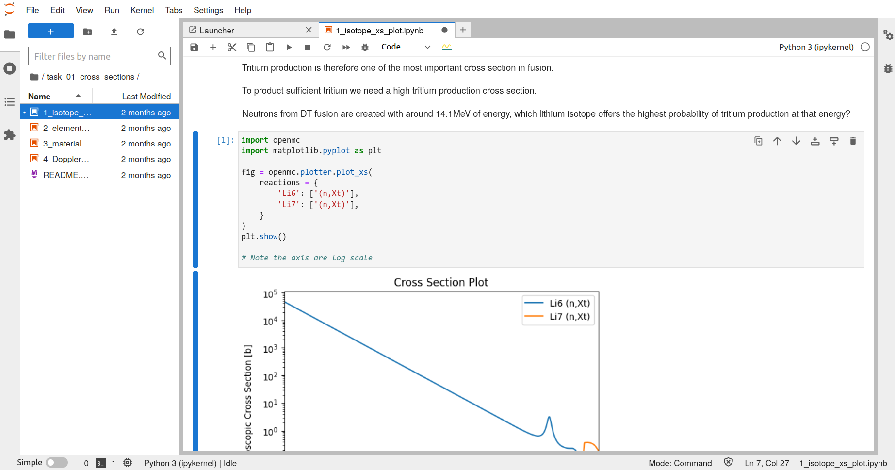
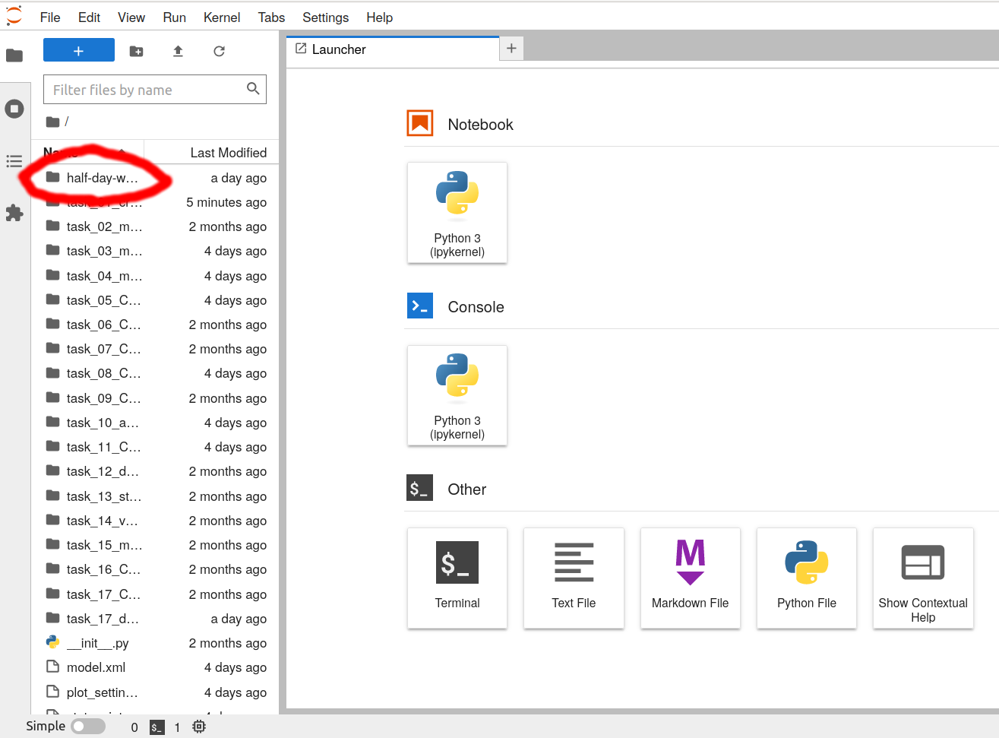
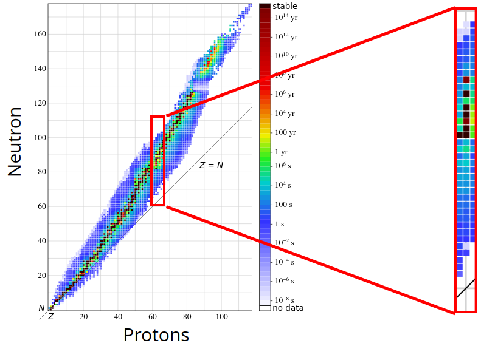
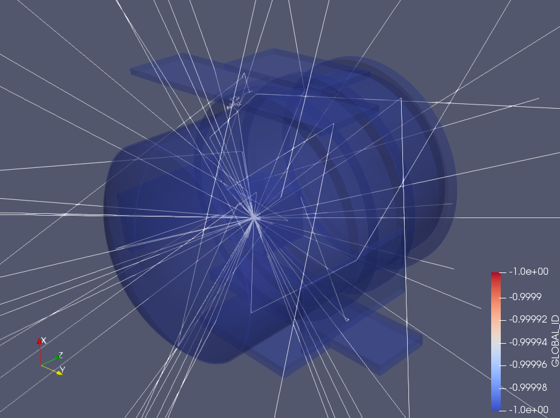
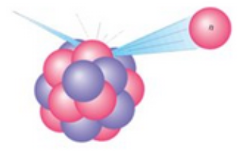
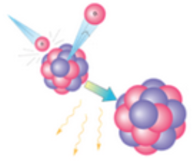
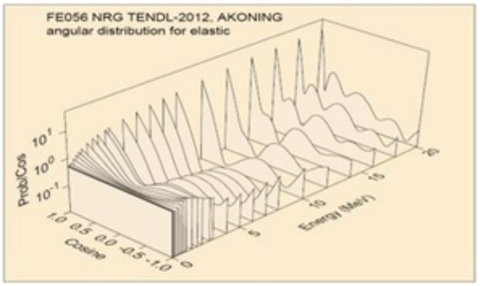
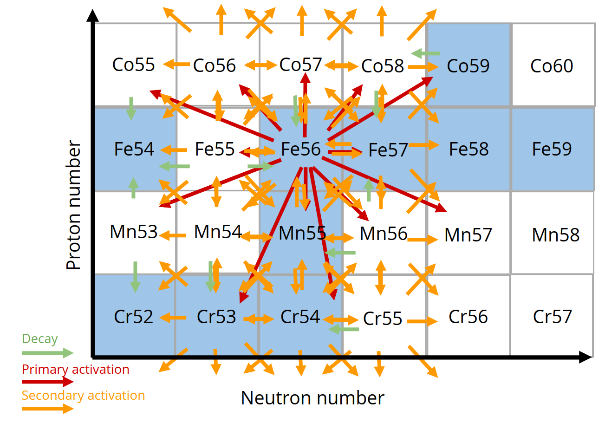
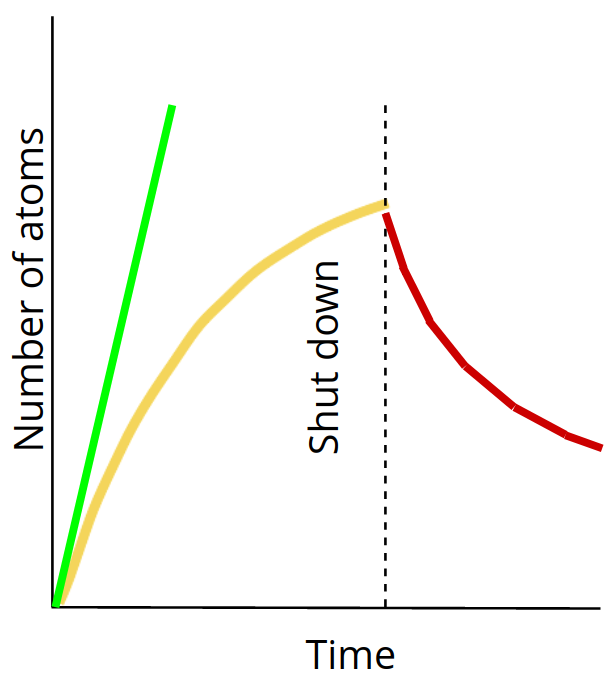

<style>
  :root {
    --color-background: #fff;
    --color-foreground: #333;
    --color-highlight: #f96;
    --color-dimmed: #888;
    font-family: 'Century Gothic';
    color: #3466C2
  }
  {
    font-size: 29px
  }
  code {
    white-space : pre-wrap !important;
    word-break: break-word;
  }
  .columns {
    display: grid;
  }
  h1 {
    justify-content: center;
  }
  section {
    justify-content: start;
  }
  img[alt~="bottom-right"] {
    position: absolute;
    top: 90%;
    right: 1%;
  }
</style>


# Fusion Neutronics Workshop


---


# Why is neutronics useful


- **Radioactivity** - Neutrons activate material, making it radioactive leading to handling and waste storage requirements.​
- **Hazardous** - Neutrons are Hazardous to health and shielded will be needed to protect the workforce.​
- ***Produce fuel*** - Neutrons will be needed to convert lithium into tritium to fuel the reactor.​
- ***Electricity*** - 80% of the energy release by each DT reaction is transferred to the neutron.​
- ***Structural integrity*** - Neutrons cause damage to materials such as embrittlement, swelling, change conductivity …​
- ***Diagnose*** - Neutrons are an important method of measuring a variety of plasma parameters (e.g. Q value).​

---

# Topics Covered Half Day Course

- Neutron and Photon interaction cross sections

- Material creation

- Particle sources

- Constructive Solid Geometry (CSG)

- Tallies (heat, tritium breeding ratio, damage, flux)

- Neutron activation

---

# Getting started

- 🐋 Install Docker

- 🔽 Download the docker image

- 🏃Run the docker image

- 🔗 Navigate to the URL in the terminal

Detailed instructions are on [<u>GitHub</u>](https://github.com/fusion-energy/neutronics-workshop/tree/main#local-installation)


---

# Containers

<div class="columns"  style="font-size: 30px;">
<div>

Install single package (Docker) and avoid installing a few hundred packages.

- Portable
- Reproducible
- Security
- Isolation
- Deployable

</div>
<div>


image source xkcd.com
</div>
<div>

---

# Tasks

<div class="columns"  style="font-size: 30px;">
<div>

- Collection of Jupyter notebooks

- Separate task folder for each topic

- Learning outcomes for each task

- Simulation outputs include:
    - numbers
    - graphs
    - images
    - 3D visualization.
</div>
<div>



</div>
<div>

---

# OpenMC

<div class="columns"  style="font-size: 30px;">
<div>

- Increasing adoption
- Supportive community
- GitHub repository
- Permissive license
- Python API

</div>
<div>

<!-- [](https://star-history.com/#openmc-dev/openmc&Date) -->
[](https://star-history.com/#openmc-dev/openmc&Date)

</div>
<div>

---


# Getting started

<div class="columns"  style="font-size: 30px;">
<div>

1. Run the docker image
    ```docker run -p 8888:8888 ghcr.io/fusion-energy/neutronics-workshop```

2. Double click on the ```half-day-workshop``` folder circled in red.

</div>
<div>



</div>
<div>

---


# Timetable

<div class="columns"  style="font-size:      20px;">
<div>

- 9.00 Introduction presentation  10
- 9.10 Plotting cross sections    30
    - task_01_isotope_xs_plot
    - task_02_element_xs_plot
    - task_03_material_xs_plot
- 9.40 Making materials            15
    - task_04_example_materials_from_isotopes
    - task_05_example_materials_from_elements
- 9.55 Geometry                   20
    - task_06_simple_csg_geometry
- 10.15 Break                      15
- 10.30 Plotting particles        35
  - task_07_point_source_plots
  - task_08_ring_source
  - task_09_plasma_source_plots

</div>
<div>

- 11.05 Tritium Breeding Ratio (TBR)    10
  - task_10_example_tritium_production
- 11.15 Damage (DPA)                    15
  - task_11_find_dpa
- 11:30 Break                           15
- 11:45 neutron photon spectra          30
  - task_12_example_neutron_spectra_on_cell  
  - task_13_example_photon_spectra
- 12.15 mesh tallies                    15
  - task_14_example_2d_regular_mesh_tallies
- 12.30 activation                      15
  - task_15_full_pulse_schedule
- 12.45 Putting it all together         15
  - task_16_optimal_design

</div>
</div>

---
# Task 1, 2, 3
# Microscopic Cross Sections

- Probability of interaction is characterised by the microscopic cross-section (σ). It is the effective size of the nucleus.

- Cross section data is key to the neutronics workflow and provide us with the likelihood of a particular interaction.

- Cross sections can be measured experimentally with monoenergetic neutrons.

---

# Experimental data

<div class="columns"  style="font-size: 30px;">
<div>

Availability of experimental data varies for different reactions and different isotopes.

Typically the experimental data is then interpreted to create evaluation libraries, such as ENDF, JEFF, JENDL, CENDL.

</div>
<div>

[](https://nds.iaea.org/dataexplorer/)


</div>
<div>

---

# Cross section reactions

Cross section evaluations exist for:

- different nuclides
- different interactions.

A list of reactions available in OpenMC is [<u>here</u>](https://docs.openmc.org/en/stable/usersguide/tallies.html#id2)

For example:
- Be9(n,2n)2He would be a neutron interaction with beryllium 9 which results in 2 neutrons and 2 helium nuclei.
- Li6(n,Xt) would be a neutron interaction with lithium 6 nuclei which results in a tritium and X is a wildcard.

---

# Reaction rate

- The reaction rate ($RR$) can be found by knowing the number of neutrons per unit volume ($n$), the velocity of neutrons ($v$), the material density ($p$), Avogadro's number ($N_{a}$), the microscopic cross section at the neutron energy ($\sigma_{e}$) and the atomic weight of the material ($M$).
- This reduces down to the neutron flux ($\phi$), nuclide number density ($N_{d}$) and microscopic cross section\sigma_{e}.
- This can be reduced one more stage by making use of the Macroscopic cross section ($\Sigma_{e}$).


$$ RR = \frac{nv\rho N_{a}\sigma_{e} }{M} = \phi N_{d} \sigma_{e} = \phi \Sigma_{e} $$

---

# Task 4, 5

# Making materials

<div class="columns"  style="font-size: 30px;">
<div>

Neutronics codes require the isotopes and the number density.

This can be provided with different combinations of density units, isotope/element concentration and weight or atom fractions.

</div>
<div>





</div>
<div>
---


# Making materials - nuclides

Simple material construction from nuclides.

```python
mat2 = openmc.Material()
mat2.add_nuclide('Li6', 0.0759*2)
mat2.add_nuclide('Li7', 0.9241*2)
mat2.add_nuclide('O16', 0.9976206)
mat2.add_nuclide('O17', 0.000379)
mat2.add_nuclide('O18', 0.0020004)
mat2.set_density('g/cm3', 2.01)
```

---


# Making materials - elements

Simpler material construction from elements.

```python
import openmc

mat1 = openmc.Material()
mat1.add_element('Li', 2)
mat1.add_element('O', 1)
mat1.set_density('g/cm3', 2.01)
```

---


# Making materials - enrichment

Simple enriched material construction from elements.

```python
import openmc

mat1 = openmc.Material()
mat1.add_element('Li', 2, enrichment_target='Li6', enrichment=60)
mat1.add_element('O', 1)
mat1.set_density('g/cm3', 2.01)
```

---

# Making Geometry

<div class="columns">
<div style="width: 150%;">

The simplest geometry is a single surface and a cell defined as below (-) that surface.

```python
import openmc

surface_sphere = openmc.Sphere(r=10.0)
region_inside_sphere = -surface_sphere
cell_sphere = openmc.Cell(region=region_inside_sphere) 

cell_sphere.fill = steel
```

</div>
<div style="display: flex; justify-content: flex-end">


</div>
<div>

---

# Making Geometry


<div class="columns">
<div style="width: 150%;">


Cells can also be constrained by multiple surfaces. This example is above (+) one surface and (&) below (-) another

```python
import openmc

surf_sphere1 = openmc.Sphere(r=10.0)
surf_sphere2 = openmc.Sphere(r=20.0)
between_spheres = +surf_sphere1 & -surf_sphere2
cell_between = openmc.Cell(region= between_spheres) 

cell_sphere.fill = steel
```

</div>
<div style="display: flex; justify-content: flex-end">


</div>
<div>


---

# Edge of the model


<div class="columns">
<div style="width: 150%;">


The outer most surface of the model should have a ```boundary_type``` set to ```"vacuum"``` to indicate that neutrons should not be tracked beyond this surface.
```python
import openmc 

surf_sphere = openmc.Sphere(r=10.0, boundary_type="vacuum")
between_spheres = -surf_sphere
cell_between = openmc.Cell(region= between_spheres) 
```


</div>
<div style="display: flex; justify-content: flex-end">


</div>
<div>

---


# Surfaces available

<div class="columns">
<div>


Constructive Solid Geometry (CSG) [<u>implementation in OpenMC</u>](https://docs.openmc.org/en/stable/usersguide/geometry.html#id2) has the following surface types.

- **XPlane**, YPlane, ZPlane, Plane
- XCylinder, YCylinder, **ZCylinder**
- **Sphere**
- XCone, YCone, ZCone,
- Quadric
- XTorus, YTorus, ZTorus

</div>
<div>


</div>
<div>

---

<!-- # CAD geometry

For more complex 3D geometry [DAGMC](https://github.com/svalinn/DAGMC) can be used which makes use of a meshed geometry to transport particles.


--- -->

# Plotting particles

<div class="columns">
<div>


Neutron and photon sources have distributions for:
- space
- energy
- direction

Visualization of the source term helps check the simulation is correct


</div>
<div>



</div>
<div>

---

# Spatial distribution of MCF and ICF sources

The spatial distribution of MCF plasma covers a larger area compared to ICF' 

<div class="columns">
<div >

<div style="width: 60%;">

</div>

</div>
<div>

.

</div>
<div>

---

# Energy distribution MCF and ICF sources


<div class="columns">
<div >


The energy distribution of MCF has less neutron scattering compared to ICF. Neutrons are:
- up scattered through collisions with alpha particles
- down scattered through collisions with DT nuclides


</div>
<div>


Neutron energy from a 50:50 DT plasma

</div>
<div>

---

# Tritium Breeding Ratio

<iframe src="https://prezi.com/embed/rnzt6pjj-xfu/?bgcolor=ffffff&lock_to_path=0&autoplay=1&autohide_ctrls=1&landing_data=bHVZZmNaNDBIWnNjdEVENDRhZDFNZGNIUE43MHdLNWpsdFJLb2ZHanI0eWk1QlBaUER3dVArS1hRQTAxNXdDZWNRPT0&landing_sign=ABm-Z3JCWCuKHnLF1Q-0yjuTsqyWAQdv3CEpUjcYcXk" title="W3Schools Free Online Web Tutorials" width="100%" height="100%"></iframe>


---

# Damage tallies


---

# Neutron spectra

---

# Neutron scattering

<div class="columns">
<div >


- (n,n)
- Neutron collides with the nucleus
- Neutron scatters of the nucleus losing energy
- Energy gained by the nucleus which recoils

image source [](https://glossary.slb.com/en/terms/e/elastic_neutron_scattering)

</div>
<div>



- (n,n'g)
- Neutron capture by the nucleus
- Instantaneously re-emitted with less energy
- Nucleus in excited state then relaxes to ground state by emitting gamma rays

</div>
<div>


---

# Neutron scattering angle


<div class="columns">
<div >

- At low energies the angular distribution is often isotropic
- As the neutron energy increases the scattering typically becomes more forward peaked
- Resonances in the cross section can impact the angular distribution probabilities

</div>
<div>


Image source tend.web.psi.ch

</div>
<div>

---

# Path length

<div class="columns">
<div >

- Path length = 1 / $\Sigma_{T}$
- A 14MeV neutron will lose energy via scattering interactions
- As the neutron energy decreases the path length also decreases
- Path length at thermal energy is more constant


</div>
<div>


</div>
<div>


---

# Energy loss

The average logarithmic energy decrement (or loss) per collision ($\xi$) is related to the atomic mass ($A$) of the nucleus

<div style='text-align: center;'>

$\xi = 1+ \frac{(A-1)^2}{2A} ln \frac{(A-1)}{(A+1)}$

</div>

<table style="width:100%">
  <tr>
    <th></th>
    <th>Hydrogen</th>
    <th>Deuterium</th>
    <th>Beryllium</th>
    <th>Carbon</th>
    <th>Uranium</th>
  </tr>
  <tr>
    <td>Mass of nucleus</td>
    <td>1</td>
    <td>2</td>
    <td>9</td>
    <td>12</td>
    <td>238</td>
  </tr>
  <tr>
    <td>Energy decrement</td>
    <td>1</td>
    <td>0.7261</td>
    <td>0.2078</td>
    <td>0.1589</td>
    <td>0.0084</td>
  </tr>
</table>

---


# Collisions to thermalize

The average number of collisions required to reduce the energy of the neutron from $E_{0}$ to $E$.

<div style='text-align: center;'>

$n = \frac{1}{\xi} (ln E_0 - ln E)$

</div>

If $E_{0}$ is 14MeV and $E$ is 0.025eV

<table style="width:100%">
  <tr>
    <th></th>
    <th>Hydrogen</th>
    <th>Deuterium</th>
    <th>Beryllium</th>
    <th>Carbon</th>
    <th>Uranium</th>
  </tr>
  <tr>
    <td>Number of collisions to thermalize</td>
    <td>20</td>
    <td>25</td>
    <td>85</td>
    <td>115</td>
    <td>2172</td>
  </tr>
</table>

---

# Moderating power

We should account for the likelihood of scattering.

The number density of the nucleus (ND) and the microscopic cross section (σ) combine to produce the macroscopic scattering cross section (Σ)

<div style='text-align: center;'>

$\Sigma _s = N_D \sigma_s$

$Moderating \; power = \xi \Sigma _s$

</div>

<table style="width:100%">
  <tr>
    <th></th>
    <th>Hydrogen</th>
    <th>Deuterium</th>
    <th>Beryllium</th>
    <th>Carbon</th>
    <th>Polyethylene</th>
  </tr>
  <tr>
    <td>Moderating power</td>
    <td>1.28</td>
    <td>0.18</td>
    <td>0.16</td>
    <td>0.064</td>
    <td>3.26</td>
  </tr>
</table>

---

# Photon spectra


---

# Mesh tallies

<div class="columns">
<div >

- A grid of voxels / mesh elements can be overlaid on a geometry and the neutron response can be tallied in each voxel.

- The mesh is typically 3D and defined with a top right and lower left coordinate.

</div>
<div>


</div>
<div>

---

# Mesh tallies


<div class="columns">
<div >

- For our example we have a grid of voxels with only 1 voxel in one direction.
- This allows a pixel image of the tally result to be easily plotted.

</div>
<div>


</div>
<div>


---

# Mesh tallies geometry


<div class="columns">
<div >

- The geometry makes use of a two spheres and a plane surface type.
- The materials in each region respond very differently to neutrons
- The task has mesh tallies with different scores and plotting to visualize the result

</div>
<div>


</div>
<div>

---

# Activation


---

# Activation



---
# Activation


<div class="columns">
<div>

- High energy neutron activation


</div>
<div>

- Low energy neutron activation


</div>
<div>

---


# Activation products from fission

- Fission of large atoms (e.g. U235)
- Results in two fission products far from stability


---

# Build up and saturation



---

# Summary task


---
